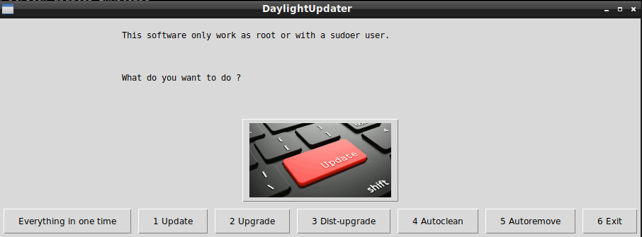

# DaylightUpdater

## What's this software ?

DaylightUpdater allow you to update, upgrade, clean, etc. any "Debian-based" Linux with a gui.





## How it work ?:  

You must be root or become root.  


## What you need to make it work :  

This game is made for Python 3.  

Install all the packages for : Python 3.  

easygui at least version 0.98  

```sh
sudo python3 -m pip install --upgrade easygui  
```  

## How to launch the game :  


```sh
python3 DaylightUpdater.py
```


## Developer - Author  


Hamdy Abou El Anein

